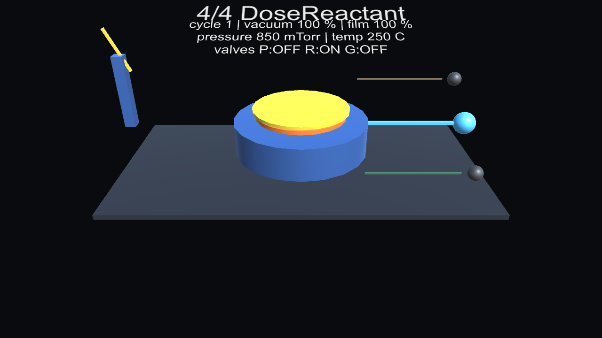

# Equipment Twin Lab

실제 장비가 없어도 장비 SW의 핵심 구조를 검증할 수 있게 만드는 제조 장비 디지털 트윈 프로젝트다.



## Unity Demo

현재 Unity 데모는 공개/합성 molybdenum ALD timeline을 읽고, chamber/wafer/film/vacuum gauge/valve/gas line 상태를 primitive 3D object로 재생한다.

검증된 실행 경로:

```powershell
.\scripts\Invoke-UnitySmokeTest.ps1 -CaptureScreenshot
```

검증 marker:

```text
EQUIPMENT_TWIN_UNITY_SMOKE_TEST_PASS
EQUIPMENT_TWIN_UNITY_SCREENSHOT_SAVED
```

주의: 이 이미지는 실제 Lam/ALTUS/Halo/Halo HX 장비 CAD나 내부 sequence가 아니라, 공개/합성 공정 상태를 보여주는 포트폴리오용 replay visual이다.

3분 녹화 체크리스트:

[docs/unity-demo-recording-checklist.md](docs/unity-demo-recording-checklist.md)

CAD/Blender 모델 교체 경계:

[docs/unity-model-swap-boundary.md](docs/unity-model-swap-boundary.md)

## 목표

- 장비 상태 전이, PLC/IO, 모션, 센서, 카메라 검사를 소프트웨어로 모델링한다.
- Unity 3D 시뮬레이터는 나중에 붙이고, 핵심 장비 로직은 C#/.NET으로 먼저 검증한다.
- 작업 결과를 초보자도 이해할 수 있게 문서화한다.

## 현재 단계

현재 MVP는 장비 상태머신, 가상 IO 모델, Clock/Timeout 모델, IO-상태 연결 계층, 공정 시나리오 JSON Runner, Scenario CLI 실행기, batch 리포트 실행기, 알람/복구 시나리오 검증, 알람 코드 체계, 알람 복구 조건, CLI 리포트 알람/복구 조건 표시, 가상 모션 축 모델, 모션 시나리오 JSON action, CLI 리포트 모션 축 표시, Equipment Template / Product Recipe 최소 모델, Template Runner, Fault Model, Fault Expected-Failure Report, Inspection Result Model, Inspection Scenario Selection, Template Runner CLI, Template Run/Batch Markdown Report까지 포함한다.

```text
Idle → Loading → Aligning → Inspecting → Unloading → Complete
```

알람 상황에서는 어떤 단계에서든 `Alarmed` 상태로 전환된다.

현재 알람은 코드와 메시지를 함께 남긴다.

```text
DoorOpened    = 1001
EmergencyStop = 1002
StateTimeout  = 1003
```

가상 모션 축은 실제 서보 드라이버 없이 Servo On, Home, Move, InPosition, Timeout, Servo Alarm 흐름을 테스트한다.

```text
Disabled → Ready → Homing → InPosition → Moving → InPosition
                                      ↘ Alarmed
```

검사 결과 모델은 실제 카메라 없이도 제품 PASS/FAIL과 측정값을 데이터로 남긴다.

```text
ProductRecipe
→ InspectionResultSpec
→ InspectionScenario
→ TemplateRunResult.InspectionResult
```

장비 실행 성공과 제품 검사 PASS/FAIL은 분리한다. 예를 들어 장비는 정상 동작했지만 제품은 `HEIGHT_OVER_LIMIT`로 NG가 될 수 있다.

같은 recipe에서도 `--inspection scratch-detected`처럼 검사 케이스를 골라 PASS/FAIL 데이터셋을 재현할 수 있다.

가상 IO는 실제 PLC 없이 입력 센서와 출력 명령을 분리해서 테스트한다.

```text
Input  = 센서/PLC가 장비 SW에게 알려주는 값
Output = 장비 SW가 밸브/램프/부저 같은 장치에 내리는 명령
```

Clock/Timeout 모델은 실제로 기다리지 않고도 “정해진 시간 안에 작업 완료 신호가 오지 않는 상황”을 테스트한다.

예:

```text
Loading 상태에서 30초 안에 LoadComplete가 오지 않으면 Alarmed 전환
```

IO-상태 연결 계층은 센서 입력을 상태머신 이벤트로 바꾼다.

예:

```text
DI_LOAD_PRESENT = true
→ LoadComplete 이벤트
→ Loading 상태에서 Aligning 상태로 전환
```

공정 시나리오 JSON은 위 흐름을 파일로 정의한다.

예:

```text
scenarios/normal-cycle.json
→ 정상 장비 사이클 실행

scenarios/loading-timeout.json
→ Loading 상태 Timeout 알람 실행
```

현재 시나리오 목록:

- `scenarios/normal-cycle.json`: 정상 사이클
- `scenarios/loading-timeout.json`: Loading Timeout 알람
- `scenarios/door-open-alarm.json`: 문 열림 알람
- `scenarios/emergency-stop-alarm.json`: 비상정지 알람
- `scenarios/clear-alarm-recovery.json`: 문 열림 알람 이후 ClearAlarm 복구
- `scenarios/door-open-clear-blocked.json`: 문이 열린 상태에서는 ClearAlarm 거부
- `scenarios/emergency-stop-recovery.json`: 비상정지 해제 이후 ClearAlarm 복구
- `scenarios/motion-axis-normal.json`: X축 Servo On, Home, Move, InPosition 정상 흐름
- `scenarios/motion-axis-timeout.json`: X축 이동 중 Timeout 알람 흐름

## 프로젝트 구조

```text
src/EquipmentTwin.Core
  장비 핵심 로직

tests/EquipmentTwin.Core.Tests
  외부 테스트 패키지 없이 실행하는 간단한 테스트 러너

state/
  현재 진행 상태와 다음 작업

goals/
  Goal 단위 작업 정의

logs/
  일일 작업 로그

docs/
  아키텍처와 유지보수 설명

scenarios/
  반복 실행 가능한 장비 운전 시나리오 JSON

templates/
  장비 구성과 제품 recipe를 정의하는 JSON
```

## 아키텍처 설명

현재 코드 구조와 유지보수 방법은 아래 문서에 정리한다.

[docs/architecture.md](docs/architecture.md)

현재 Core가 검증하는 범위와 한계는 아래 문서에 정리한다.

[docs/core-validation.md](docs/core-validation.md)

Visual Studio에서 build/debug하는 방법은 아래 문서에 정리한다.

[docs/visual-studio.md](docs/visual-studio.md)

## 실행 방법

```powershell
dotnet restore --ignore-failed-sources
dotnet build --no-restore
dotnet run --project tests\EquipmentTwin.Core.Tests --no-restore
```

## 시나리오 직접 실행

정상 사이클:

```powershell
dotnet run --project src\EquipmentTwin.Cli -- scenarios\normal-cycle.json
```

Loading Timeout:

```powershell
dotnet run --project src\EquipmentTwin.Cli -- scenarios\loading-timeout.json --default-timeouts
```

전체 시나리오 batch 실행과 Markdown 리포트 저장:

```powershell
dotnet run --project src\EquipmentTwin.Cli -- batch scenarios --default-timeouts --report artifacts\scenario-report.md
```

생성되는 Markdown 리포트는 각 시나리오의 최종 상태뿐 아니라 `Active Alarm`, `Clear Condition`, `Motion Axes`도 표시한다.

예를 들어 문이 열린 알람 시나리오는 `DoorOpened (1001)`과 `Blocked: Door must be closed before clearing DoorOpened alarm.`처럼 표시된다.

## 장비 template 직접 실행

제품 PASS 케이스:

```powershell
dotnet run --project src\EquipmentTwin.Cli -- template run templates\vision-inspection-cell.json default-panel --report artifacts\template-run-report.md
```

제품 FAIL 케이스:

```powershell
dotnet run --project src\EquipmentTwin.Cli -- template run templates\vision-inspection-cell.json tall-part
```

fault 주입 케이스:

```powershell
dotnet run --project src\EquipmentTwin.Cli -- template run templates\vision-inspection-cell.json default-panel --fault x-axis-move-timeout
```

fault 실패를 기대값으로 검증하고 report 저장:

```powershell
dotnet run --project src\EquipmentTwin.Cli -- template run templates\vision-inspection-cell.json default-panel --fault x-axis-move-timeout --expect-execution-failure --report artifacts\template-fault-expected-failure-report.md
```

선택한 검사 케이스 실행:

```powershell
dotnet run --project src\EquipmentTwin.Cli -- template run templates\vision-inspection-cell.json default-panel --inspection scratch-detected --report artifacts\template-inspection-scenario-report.md
```

template 안의 모든 recipe를 한 번에 실행하고 비교 report 저장:

```powershell
dotnet run --project src\EquipmentTwin.Cli -- template batch templates\vision-inspection-cell.json --report artifacts\template-batch-report.md
```

template CLI는 `Execution`과 `Product`를 분리해서 보여준다.

```text
Execution = 장비 실행 성공/실패
Product   = 제품 검사 PASS/FAIL
```

`--report`를 넣으면 같은 결과를 Markdown 파일로 저장한다. 이 파일은 포트폴리오나 작업 로그에 붙이기 쉽다.

## 자동 검증

GitHub Actions CI가 push/PR마다 아래 검증을 실행한다.

```text
dotnet restore EquipmentTwinLab.sln --ignore-failed-sources
dotnet build EquipmentTwinLab.sln --no-restore --configuration Release
dotnet run --project tests/EquipmentTwin.Core.Tests/EquipmentTwin.Core.Tests.csproj --no-restore --configuration Release
dotnet run --project src/EquipmentTwin.Cli/EquipmentTwin.Cli.csproj --no-restore --configuration Release -- scenarios/normal-cycle.json
dotnet run --project src/EquipmentTwin.Cli/EquipmentTwin.Cli.csproj --no-restore --configuration Release -- scenarios/loading-timeout.json --default-timeouts
dotnet run --project src/EquipmentTwin.Cli/EquipmentTwin.Cli.csproj --no-restore --configuration Release -- batch scenarios --default-timeouts --report artifacts/scenario-report.md
dotnet run --project src/EquipmentTwin.Cli/EquipmentTwin.Cli.csproj --no-restore --configuration Release -- template run templates/vision-inspection-cell.json default-panel --report artifacts/template-run-report.md
dotnet run --project src/EquipmentTwin.Cli/EquipmentTwin.Cli.csproj --no-restore --configuration Release -- template run templates/vision-inspection-cell.json tall-part
dotnet run --project src/EquipmentTwin.Cli/EquipmentTwin.Cli.csproj --no-restore --configuration Release -- template run templates/vision-inspection-cell.json default-panel --inspection scratch-detected --report artifacts/template-inspection-scenario-report.md
dotnet run --project src/EquipmentTwin.Cli/EquipmentTwin.Cli.csproj --no-restore --configuration Release -- template run templates/vision-inspection-cell.json default-panel --fault x-axis-move-timeout --expect-execution-failure --report artifacts/template-fault-expected-failure-report.md
dotnet run --project src/EquipmentTwin.Cli/EquipmentTwin.Cli.csproj --no-restore --configuration Release -- template batch templates/vision-inspection-cell.json --report artifacts/template-batch-report.md
```

## GitHub

공개 저장소:

<https://github.com/sjsr-0401/equipment-twin-lab>

## Unity Process Player Skeleton

The repository now includes the first Unity-side skeleton:

```text
unity/EquipmentTwin.Unity
```

It reads the process timeline JSON generated by the .NET CLI and displays the current ALD process state with a minimal `OnGUI` HUD.

Unity-side flow:

```text
moly-ald-timeline.json
  -> MolyAldTimelineLoader
  -> MolyAldProcessPlayer
  -> MolyAldProcessHud
```

Open the Unity skeleton folder in Unity Hub:

```text
unity/EquipmentTwin.Unity
```

Minimal setup:

1. Create an empty GameObject.
2. Add `MolyAldProcessPlayer`.
3. Add `MolyAldProcessHud`.
4. Press Play.

The default player path points to:

```text
Assets/StreamingAssets/moly-ald-timeline.sample.json
```

## Unity Primitive Process Visual

Goal 028 adds the first visible 3D process layer.

Recommended Unity setup:

1. Open `unity/EquipmentTwin.Unity` in Unity Hub.
2. Create one empty GameObject.
3. Add `MolyAldDemoBootstrap`.
4. Press Play.

`MolyAldDemoBootstrap` automatically adds:

- `MolyAldProcessPlayer`
- `MolyAldProcessHud`
- `MolyAldPrimitiveVisualizer`
- a demo camera
- a directional light

Visual mapping:

| Timeline field | Unity primitive visual |
|---|---|
| `chamberPressureMtorr` | chamber color, vacuum column, gauge needle |
| `waferTemperatureC` | wafer color |
| `valves.metalPrecursor` | precursor valve sphere |
| `valves.reactant` | reactant valve sphere |
| `valves.purge` | purge valve sphere |
| `estimatedThicknessAngstrom` | film overlay disk size/color |

## Unity Smoke Test

After activating the Unity Editor license in Unity Hub, run:

```powershell
.\scripts\Invoke-UnitySmokeTest.ps1
```

Expected success marker:

```text
EQUIPMENT_TWIN_UNITY_SMOKE_TEST_PASS
```

Manual Unity menu path:

```text
Equipment Twin > Run Moly ALD Smoke Test
Equipment Twin > Create Moly ALD Demo Scene
```

Detailed checklist:

```text
docs/unity-smoke-test.md
```

To capture the first demo screenshot after Unity Hub license activation:

```powershell
.\scripts\Invoke-UnitySmokeTest.ps1 -CaptureScreenshot
```

Default screenshot output:

```text
artifacts/unity-demo/moly-ald-demo.png
```

## Process Timeline JSON Export

The public molybdenum ALD process can export a Unity-ready JSON timeline.

```powershell
dotnet run --project src\EquipmentTwin.Cli -- process run processes\public-moly-ald-metallization.json --report artifacts\moly-ald-process-report.md --timeline artifacts\moly-ald-timeline.json
```

The JSON schema is intentionally simple:

```text
recipeName
success
finalStep
steps[]
  step
  cycle
  durationMilliseconds
  chamberPressureMtorr
  waferTemperatureC
  valves.metalPrecursor
  valves.reactant
  valves.purge
  estimatedThicknessAngstrom
```

Unity should consume this file instead of parsing the Markdown report.

## Public Molybdenum ALD Process Model

This repository now includes a public/synthetic molybdenum ALD metallization process model.

It is inspired only by public ALD / ALTUS Halo descriptions and does not contain real equipment recipes, real vendor internals, real alarm codes, or real test procedures.

Run the normal synthetic process:

```powershell
dotnet run --project src\EquipmentTwin.Cli -- process run processes\public-moly-ald-metallization.json --report artifacts\moly-ald-process-report.md
```

Run a synthetic pump-down fault:

```powershell
dotnet run --project src\EquipmentTwin.Cli -- process run processes\public-moly-ald-metallization.json --fault pumpdown-timeout
```

The process report contains a Unity-ready replay timeline:

```text
step
cycle
pressure
temperature
precursor valve
reactant valve
purge valve
estimated film thickness
```

## Portfolio Demo Package

The current demo story is documented here:

```text
docs/portfolio-demo-package.md
```

The 3-minute recording checklist is documented here:

```text
docs/unity-demo-recording-checklist.md
```

The CAD/Blender model swap boundary is documented here:

```text
docs/unity-model-swap-boundary.md
```

Use it as the interview/demo script for explaining:

- what the project proves today;
- why Core/CLI owns the process truth;
- how Unity replays the timeline instead of calculating process logic;
- what is still blocked by Unity Hub license activation;
- what should not be claimed as real Lam/ALTUS/Halo equipment behavior.

Current local Unity blocker:

```text
Unity Editor is installed, but screenshot generation requires Unity Hub license activation.
```

After activating the Unity license, run:

```powershell
.\scripts\Invoke-UnitySmokeTest.ps1 -CaptureScreenshot
```
