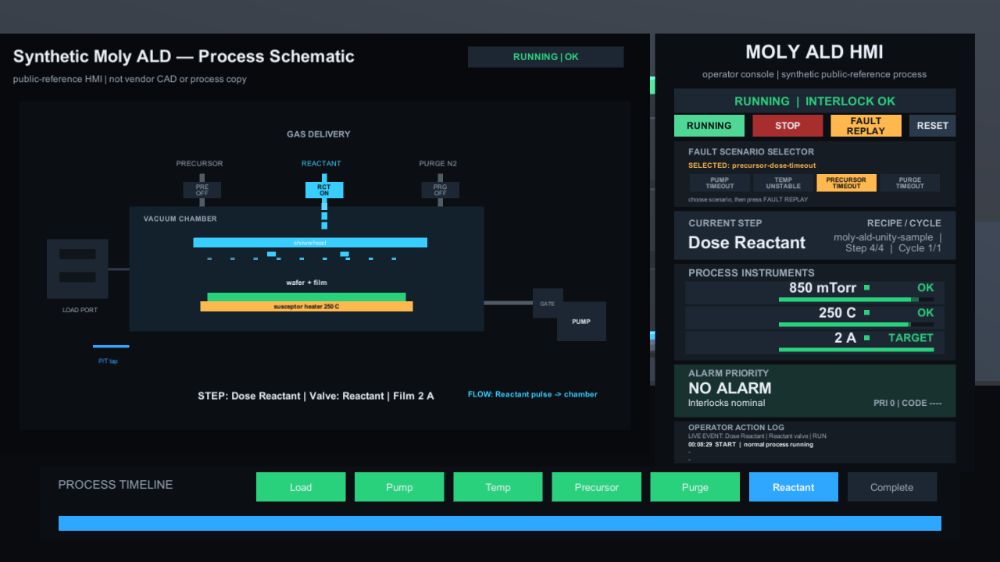

# Equipment Twin Lab

실제 장비가 없어도 장비 SW의 핵심 구조를 검증할 수 있게 만드는 제조 장비 디지털 트윈 프로젝트다.

## 대표 데모 흐름: WPF HMI + 알람 가이드 + Mock Server

현재 대표 화면은 WPF operator console이다. Unity는 선택형 3D/replay viewer로 남기고, 매일 개발·디버깅·포트폴리오 설명은 WPF HMI를 중심으로 진행한다.

대표 데모 흐름:

```text
WPF HMI
→ Fault Replay 실행
→ Alarm Response Guide 표시
→ Issue Report Export
→ Server Outbox 저장
→ Mock Server로 전송
→ Mock Server 수신 payload 저장
```

이 흐름은 장비에서 알람이 발생했을 때 operator가 체크리스트를 확인하고, 선택한 대응과 장비 snapshot, engineering trace를 issue report로 남긴 뒤, 서버로 보낼 payload까지 만드는 과정을 보여준다.

WPF HMI 실행:

```powershell
dotnet run --project .\src\EquipmentTwin.Hmi.Wpf\EquipmentTwin.Hmi.Wpf.csproj
```

Local mock server 실행:

```powershell
dotnet run --project .\src\EquipmentTwin.MockServer\EquipmentTwin.MockServer.csproj
```

Mock server가 실행된 상태에서 WPF의 `QUEUE REPORT TO SERVER`를 누르면 report payload가 local outbox에 저장된다. 이후 `SEND TO MOCK SERVER`를 누르면 `http://127.0.0.1:5088/alarm-issue-report`로 전송되고, mock server는 받은 payload를 `artifacts/mock-server-received/`에 저장한다.

정직한 경계:

- 이 프로젝트는 실제 MES, SECS/GEM, 설비 vendor 내부 시스템을 구현한 것이 아니다.
- ALD 공정과 알람은 공개 자료 기반의 합성 demo model이다.
- 핵심 목표는 장비 SW의 구조, 상태 전이, 알람 대응, operator report, 서버 연동 경계를 포트폴리오로 설명 가능하게 만드는 것이다.

Visual Studio에서 볼 때는 아래 project를 startup project로 설정하고 `F5`를 누르면 된다.

```text
EquipmentTwin.Hmi.Wpf
```

관련 문서:

[docs/wpf-main-hmi.md](docs/wpf-main-hmi.md)

[docs/mock-server.md](docs/mock-server.md)

[docs/architecture.md](docs/architecture.md)

## Unity Demo



현재 Unity 데모는 공개/합성 molybdenum ALD timeline을 읽고, 왼쪽에는 ALD process schematic, 오른쪽에는 Canvas 기반 HMI operator interface, 아래에는 Canvas process timeline을 배치한 장비 콘솔 화면으로 재생한다.

대표 screenshot에는 gas delivery, vacuum chamber, showerhead, wafer/film, susceptor heater, exhaust/pump path, recipe card, pressure/temp/film instrument card, alarm priority card, process timeline이 같이 표시된다. Pressure/Temp/Film은 값+단위 readout, 상태, 정상범위 band, 현재값 fill로 나눠 보여준다. Active gas pulse와 flow label은 현재 step에서 어떤 gas path가 살아있는지 보여준다. 3D blockout은 메인 화면에서 내리고, Core/CLI가 만든 공정 timeline을 사용자가 이해하기 쉬운 2D HMI schematic으로 보여준다.

검증된 실행 경로:

```powershell
.\scripts\Invoke-UnitySmokeTest.ps1 -CaptureScreenshot
```

검증 marker:

```text
EQUIPMENT_TWIN_UNITY_SMOKE_TEST_PASS
EQUIPMENT_TWIN_UNITY_SCREENSHOT_SAVED
```

주의: 이 이미지는 실제 Lam/ALTUS/Halo/Halo HX 장비 CAD, 실제 UI, 실제 내부 sequence가 아니라, 공개/합성 공정 상태를 보여주는 포트폴리오용 synthetic equipment console이다.

3분 녹화 체크리스트:

[docs/unity-demo-recording-checklist.md](docs/unity-demo-recording-checklist.md)

3분 녹화 리허설 실행기:

[docs/demo-rehearsal-runner.md](docs/demo-rehearsal-runner.md)

3분 녹화 한글 대본/큐카드:

[docs/portfolio-demo-narration.md](docs/portfolio-demo-narration.md)

CAD/Blender 모델 교체 경계:

[docs/unity-model-swap-boundary.md](docs/unity-model-swap-boundary.md)

UI/UX reviewer 기준과 Canvas operator panel 전환 계획:

[docs/design/operator-console-design-system.md](docs/design/operator-console-design-system.md)

공개 ALD/HMI schematic reference 경계:

[docs/design/public-ald-schematic-reference.md](docs/design/public-ald-schematic-reference.md)

## 목표

- 장비 상태 전이, PLC/IO, 모션, 센서, 카메라 검사를 소프트웨어로 모델링한다.
- Unity 3D 시뮬레이터는 나중에 붙이고, 핵심 장비 로직은 C#/.NET으로 먼저 검증한다.
- 작업 결과를 초보자도 이해할 수 있게 문서화한다.

## 현재 단계

현재 MVP는 장비 상태머신, 가상 IO 모델, Clock/Timeout 모델, IO-상태 연결 계층, 공정 시나리오 JSON Runner, Scenario CLI 실행기, batch 리포트 실행기, 알람/복구 시나리오 검증, 알람 코드 체계, 알람 복구 조건, CLI 리포트 알람/복구 조건 표시, 가상 모션 축 모델, 모션 시나리오 JSON action, CLI 리포트 모션 축 표시, Equipment Template / Product Recipe 최소 모델, Template Runner, Fault Model, Fault Expected-Failure Report, Inspection Result Model, Inspection Scenario Selection, Template Runner CLI, Template Run/Batch Markdown Report까지 포함한다.

```text
Idle → Loading → Aligning → Inspecting → Unloading → Complete
```

알람 상황에서는 어떤 단계에서든 `Alarmed` 상태로 전환된다.

현재 알람은 코드와 메시지를 함께 남긴다.

```text
DoorOpened    = 1001
EmergencyStop = 1002
StateTimeout  = 1003
```

가상 모션 축은 실제 서보 드라이버 없이 Servo On, Home, Move, InPosition, Timeout, Servo Alarm 흐름을 테스트한다.

```text
Disabled → Ready → Homing → InPosition → Moving → InPosition
                                      ↘ Alarmed
```

검사 결과 모델은 실제 카메라 없이도 제품 PASS/FAIL과 측정값을 데이터로 남긴다.

```text
ProductRecipe
→ InspectionResultSpec
→ InspectionScenario
→ TemplateRunResult.InspectionResult
```

장비 실행 성공과 제품 검사 PASS/FAIL은 분리한다. 예를 들어 장비는 정상 동작했지만 제품은 `HEIGHT_OVER_LIMIT`로 NG가 될 수 있다.

같은 recipe에서도 `--inspection scratch-detected`처럼 검사 케이스를 골라 PASS/FAIL 데이터셋을 재현할 수 있다.

가상 IO는 실제 PLC 없이 입력 센서와 출력 명령을 분리해서 테스트한다.

```text
Input  = 센서/PLC가 장비 SW에게 알려주는 값
Output = 장비 SW가 밸브/램프/부저 같은 장치에 내리는 명령
```

Clock/Timeout 모델은 실제로 기다리지 않고도 “정해진 시간 안에 작업 완료 신호가 오지 않는 상황”을 테스트한다.

예:

```text
Loading 상태에서 30초 안에 LoadComplete가 오지 않으면 Alarmed 전환
```

IO-상태 연결 계층은 센서 입력을 상태머신 이벤트로 바꾼다.

예:

```text
DI_LOAD_PRESENT = true
→ LoadComplete 이벤트
→ Loading 상태에서 Aligning 상태로 전환
```

공정 시나리오 JSON은 위 흐름을 파일로 정의한다.

예:

```text
scenarios/normal-cycle.json
→ 정상 장비 사이클 실행

scenarios/loading-timeout.json
→ Loading 상태 Timeout 알람 실행
```

현재 시나리오 목록:

- `scenarios/normal-cycle.json`: 정상 사이클
- `scenarios/loading-timeout.json`: Loading Timeout 알람
- `scenarios/door-open-alarm.json`: 문 열림 알람
- `scenarios/emergency-stop-alarm.json`: 비상정지 알람
- `scenarios/clear-alarm-recovery.json`: 문 열림 알람 이후 ClearAlarm 복구
- `scenarios/door-open-clear-blocked.json`: 문이 열린 상태에서는 ClearAlarm 거부
- `scenarios/emergency-stop-recovery.json`: 비상정지 해제 이후 ClearAlarm 복구
- `scenarios/motion-axis-normal.json`: X축 Servo On, Home, Move, InPosition 정상 흐름
- `scenarios/motion-axis-timeout.json`: X축 이동 중 Timeout 알람 흐름

## 프로젝트 구조

```text
src/EquipmentTwin.Core
  장비 핵심 로직

src/EquipmentTwin.Hmi.Wpf
  operator가 보는 WPF HMI 화면

src/EquipmentTwin.MockServer
  HMI가 만든 issue report payload를 받아보는 local mock server

tests/EquipmentTwin.Core.Tests
  외부 테스트 패키지 없이 실행하는 간단한 테스트 러너

state/
  현재 진행 상태와 다음 작업

goals/
  Goal 단위 작업 정의

logs/
  일일 작업 로그

docs/
  아키텍처와 유지보수 설명

artifacts/
  실행 중 생성되는 report, outbox payload, mock server 수신 파일

scenarios/
  반복 실행 가능한 장비 운전 시나리오 JSON

templates/
  장비 구성과 제품 recipe를 정의하는 JSON
```

## 아키텍처 설명

현재 코드 구조와 유지보수 방법은 아래 문서에 정리한다.

[docs/architecture.md](docs/architecture.md)

현재 Core가 검증하는 범위와 한계는 아래 문서에 정리한다.

[docs/core-validation.md](docs/core-validation.md)

Visual Studio에서 build/debug하는 방법은 아래 문서에 정리한다.

[docs/visual-studio.md](docs/visual-studio.md)

Local mock server로 report payload를 보내는 방법은 아래 문서에 정리한다.

[docs/mock-server.md](docs/mock-server.md)

## 실행 방법

전체 build와 Core test:

```powershell
dotnet restore --ignore-failed-sources
dotnet build --no-restore
dotnet run --project tests\EquipmentTwin.Core.Tests --no-restore
```

WPF HMI 실행:

```powershell
dotnet run --project .\src\EquipmentTwin.Hmi.Wpf\EquipmentTwin.Hmi.Wpf.csproj
```

Local mock server 실행:

```powershell
dotnet run --project .\src\EquipmentTwin.MockServer\EquipmentTwin.MockServer.csproj
```

데모 확인 순서:

1. terminal 하나에서 mock server를 실행한다.
2. 다른 terminal 또는 Visual Studio에서 WPF HMI를 실행한다.
3. WPF에서 `FAULT REPLAY`로 알람을 발생시킨다.
4. alarm response guide의 checklist와 response choice를 선택한다.
5. `EXPORT ISSUE REPORT`로 report를 저장한다.
6. `QUEUE REPORT TO SERVER`로 local outbox payload를 만든다.
7. `SEND TO MOCK SERVER`로 mock server에 전송한다.
8. `artifacts/mock-server-received/`에서 수신 payload를 확인한다.

## 시나리오 직접 실행

정상 사이클:

```powershell
dotnet run --project src\EquipmentTwin.Cli -- scenarios\normal-cycle.json
```

Loading Timeout:

```powershell
dotnet run --project src\EquipmentTwin.Cli -- scenarios\loading-timeout.json --default-timeouts
```

전체 시나리오 batch 실행과 Markdown 리포트 저장:

```powershell
dotnet run --project src\EquipmentTwin.Cli -- batch scenarios --default-timeouts --report artifacts\scenario-report.md
```

생성되는 Markdown 리포트는 각 시나리오의 최종 상태뿐 아니라 `Active Alarm`, `Clear Condition`, `Motion Axes`도 표시한다.

예를 들어 문이 열린 알람 시나리오는 `DoorOpened (1001)`과 `Blocked: Door must be closed before clearing DoorOpened alarm.`처럼 표시된다.

## 장비 template 직접 실행

제품 PASS 케이스:

```powershell
dotnet run --project src\EquipmentTwin.Cli -- template run templates\vision-inspection-cell.json default-panel --report artifacts\template-run-report.md
```

제품 FAIL 케이스:

```powershell
dotnet run --project src\EquipmentTwin.Cli -- template run templates\vision-inspection-cell.json tall-part
```

fault 주입 케이스:

```powershell
dotnet run --project src\EquipmentTwin.Cli -- template run templates\vision-inspection-cell.json default-panel --fault x-axis-move-timeout
```

fault 실패를 기대값으로 검증하고 report 저장:

```powershell
dotnet run --project src\EquipmentTwin.Cli -- template run templates\vision-inspection-cell.json default-panel --fault x-axis-move-timeout --expect-execution-failure --report artifacts\template-fault-expected-failure-report.md
```

선택한 검사 케이스 실행:

```powershell
dotnet run --project src\EquipmentTwin.Cli -- template run templates\vision-inspection-cell.json default-panel --inspection scratch-detected --report artifacts\template-inspection-scenario-report.md
```

template 안의 모든 recipe를 한 번에 실행하고 비교 report 저장:

```powershell
dotnet run --project src\EquipmentTwin.Cli -- template batch templates\vision-inspection-cell.json --report artifacts\template-batch-report.md
```

template CLI는 `Execution`과 `Product`를 분리해서 보여준다.

```text
Execution = 장비 실행 성공/실패
Product   = 제품 검사 PASS/FAIL
```

`--report`를 넣으면 같은 결과를 Markdown 파일로 저장한다. 이 파일은 포트폴리오나 작업 로그에 붙이기 쉽다.

## 자동 검증

GitHub Actions CI가 push/PR마다 아래 검증을 실행한다.

```text
dotnet restore EquipmentTwinLab.sln --ignore-failed-sources
dotnet build EquipmentTwinLab.sln --no-restore --configuration Release
dotnet run --project tests/EquipmentTwin.Core.Tests/EquipmentTwin.Core.Tests.csproj --no-restore --configuration Release
dotnet run --project src/EquipmentTwin.Cli/EquipmentTwin.Cli.csproj --no-restore --configuration Release -- scenarios/normal-cycle.json
dotnet run --project src/EquipmentTwin.Cli/EquipmentTwin.Cli.csproj --no-restore --configuration Release -- scenarios/loading-timeout.json --default-timeouts
dotnet run --project src/EquipmentTwin.Cli/EquipmentTwin.Cli.csproj --no-restore --configuration Release -- batch scenarios --default-timeouts --report artifacts/scenario-report.md
dotnet run --project src/EquipmentTwin.Cli/EquipmentTwin.Cli.csproj --no-restore --configuration Release -- template run templates/vision-inspection-cell.json default-panel --report artifacts/template-run-report.md
dotnet run --project src/EquipmentTwin.Cli/EquipmentTwin.Cli.csproj --no-restore --configuration Release -- template run templates/vision-inspection-cell.json tall-part
dotnet run --project src/EquipmentTwin.Cli/EquipmentTwin.Cli.csproj --no-restore --configuration Release -- template run templates/vision-inspection-cell.json default-panel --inspection scratch-detected --report artifacts/template-inspection-scenario-report.md
dotnet run --project src/EquipmentTwin.Cli/EquipmentTwin.Cli.csproj --no-restore --configuration Release -- template run templates/vision-inspection-cell.json default-panel --fault x-axis-move-timeout --expect-execution-failure --report artifacts/template-fault-expected-failure-report.md
dotnet run --project src/EquipmentTwin.Cli/EquipmentTwin.Cli.csproj --no-restore --configuration Release -- template batch templates/vision-inspection-cell.json --report artifacts/template-batch-report.md
```

## GitHub

공개 저장소:

<https://github.com/sjsr-0401/equipment-twin-lab>

## Unity Process Player Skeleton

이 저장소에는 Unity 쪽 첫 skeleton이 포함되어 있다.

```text
unity/EquipmentTwin.Unity
```

이 Unity skeleton은 .NET CLI가 생성한 process timeline JSON을 읽고, 현재 ALD 공정 상태를 최소한의 `OnGUI` HUD로 표시한다.

Unity 쪽 흐름:

```text
moly-ald-timeline.json
  -> MolyAldTimelineLoader
  -> MolyAldProcessPlayer
  -> MolyAldProcessHud
```

Unity Hub에서 아래 skeleton folder를 연다.

```text
unity/EquipmentTwin.Unity
```

최소 설정:

1. 빈 GameObject를 만든다.
2. `MolyAldProcessPlayer`를 추가한다.
3. `MolyAldProcessHud`를 추가한다.
4. Play를 누른다.

기본 player path는 아래 파일을 가리킨다.

```text
Assets/StreamingAssets/moly-ald-timeline.sample.json
```

## Unity Primitive Process Visual

Goal 028은 처음으로 눈에 보이는 3D process layer를 추가했다.

권장 Unity 설정:

1. Unity Hub에서 `unity/EquipmentTwin.Unity`를 연다.
2. 빈 GameObject를 하나 만든다.
3. `MolyAldDemoBootstrap`을 추가한다.
4. Play를 누른다.

`MolyAldDemoBootstrap`은 아래 요소를 자동으로 추가한다.

- `MolyAldProcessPlayer`
- `MolyAldProcessHud`
- `MolyAldPrimitiveVisualizer`
- demo camera
- directional light

시각화 mapping:

| Timeline field | Unity primitive visual |
|---|---|
| `chamberPressureMtorr` | chamber color, vacuum column, gauge needle |
| `waferTemperatureC` | wafer color |
| `valves.metalPrecursor` | precursor valve sphere |
| `valves.reactant` | reactant valve sphere |
| `valves.purge` | purge valve sphere |
| `estimatedThicknessAngstrom` | film overlay disk size/color |

## Unity Smoke Test

Unity Hub에서 Unity Editor license를 활성화한 뒤 아래 명령을 실행한다.

```powershell
.\scripts\Invoke-UnitySmokeTest.ps1
```

기대 성공 marker:

```text
EQUIPMENT_TWIN_UNITY_SMOKE_TEST_PASS
```

Unity Editor에서 수동으로 실행할 때의 menu path:

```text
Equipment Twin > Run Moly ALD Smoke Test
Equipment Twin > Create Moly ALD Demo Scene
```

자세한 checklist:

```text
docs/unity-smoke-test.md
```

Unity Hub license 활성화 후 첫 demo screenshot을 캡처하려면 아래 명령을 실행한다.

```powershell
.\scripts\Invoke-UnitySmokeTest.ps1 -CaptureScreenshot
```

기본 screenshot 출력 위치:

```text
artifacts/unity-demo/moly-ald-demo.png
```

## Process Timeline JSON Export

공개/합성 molybdenum ALD process는 Unity가 바로 읽을 수 있는 JSON timeline을 export할 수 있다.

```powershell
dotnet run --project src\EquipmentTwin.Cli -- process run processes\public-moly-ald-metallization.json --report artifacts\moly-ald-process-report.md --timeline artifacts\moly-ald-timeline.json
```

JSON schema는 의도적으로 단순하게 유지한다.

```text
recipeName
success
finalStep
steps[]
  step
  cycle
  durationMilliseconds
  chamberPressureMtorr
  waferTemperatureC
  valves.metalPrecursor
  valves.reactant
  valves.purge
  estimatedThicknessAngstrom
```

Unity는 Markdown report를 parsing하지 않고 이 JSON file을 읽어야 한다.

## Public Molybdenum ALD Process Model

이 저장소에는 공개/합성 molybdenum ALD metallization process model이 포함되어 있다.

이 모델은 공개된 ALD / ALTUS Halo 설명에서 개념만 참고한 것이다. 실제 장비 recipe, vendor 내부 구현, 실제 alarm code, 실제 test procedure는 포함하지 않는다.

정상 합성 process 실행:

```powershell
dotnet run --project src\EquipmentTwin.Cli -- process run processes\public-moly-ald-metallization.json --report artifacts\moly-ald-process-report.md
```

합성 pump-down fault 실행:

```powershell
dotnet run --project src\EquipmentTwin.Cli -- process run processes\public-moly-ald-metallization.json --fault pumpdown-timeout
```

정상 process와 설정된 모든 합성 fault를 matrix로 실행:

```powershell
dotnet run --project src\EquipmentTwin.Cli -- process batch processes\public-moly-ald-metallization.json --report artifacts\moly-ald-fault-matrix-report.md
```

Batch command는 정상 case가 pass하고, 설정된 모든 fault case가 안전하게 `Alarmed`로 실패하는 것을 기대한다.
모든 기대 결과가 맞을 때만 exit code `0`으로 종료한다.

Process report에는 Unity가 replay할 수 있는 timeline이 포함된다.

```text
step
cycle
pressure
temperature
precursor valve
reactant valve
purge valve
estimated film thickness
```

## Portfolio Demo Package

현재 demo story 문서:

```text
docs/portfolio-demo-package.md
```

3분 녹화 checklist 문서:

```text
docs/unity-demo-recording-checklist.md
```

Demo rehearsal runner 문서:

```text
docs/demo-rehearsal-runner.md
```

CAD/Blender model swap 경계 문서:

```text
docs/unity-model-swap-boundary.md
```

면접/demo에서 아래 내용을 설명하는 script로 사용한다.

- 현재 프로젝트가 무엇을 증명하는지
- 왜 Core/CLI가 process truth를 가져야 하는지
- Unity가 process logic을 계산하지 않고 timeline을 replay하는 이유
- Unity Hub license activation 때문에 아직 막힌 것이 무엇인지
- 실제 Lam/ALTUS/Halo 장비 동작이라고 주장하면 안 되는 범위가 무엇인지

현재 local Unity blocker:

```text
Unity Editor is installed, but screenshot generation requires Unity Hub license activation.
```

Unity license를 활성화한 뒤 실행:

```powershell
.\scripts\Invoke-UnitySmokeTest.ps1 -CaptureScreenshot
```
